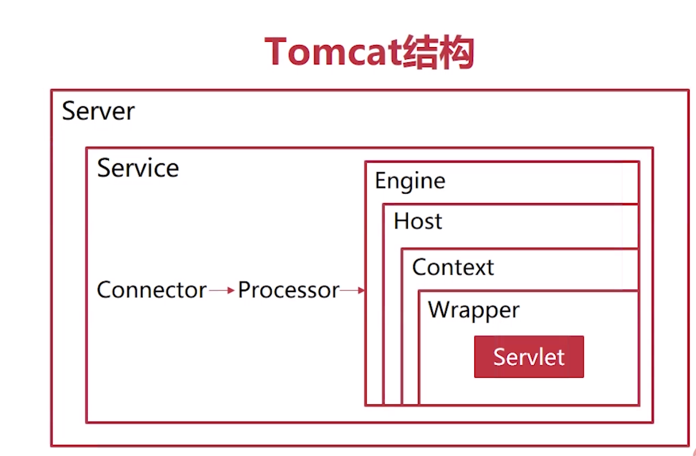

### DNS域名解析过程

域名到ip地址的解析

www.google.com.root===>从右向左域名的等级由高向低。

根域名：root

顶级域名：com，edu，org。

次级域名：google，mit，

主机名：www

域名的查找方式：

递归查找：查找请求由顶级服务器由高向低发送给低级的域名服务器，查找方式为递归请求方式

迭代查找：DNS服务器查找请求时发送给根域名服务器，根域名服务器如果无法查找到结果，就返回顶级域名服务器地址，由DNS服务器再次发送请求进行查找，迭代查找过程

各层级的服务器都具有缓存，例如浏览器等

### java IO

字符流：Reader和Writer

Reader：BufferedReader，FilterReader，InputStreamReader-FileReader

Writer：BufferedWriter，FilterWriter，OutputStreamWriter和FileWriter

字节流：InputStream和OutputStream

InputStream：ByteArrayInputStream，FileInputStream

OutputStream：ByteArrayOutputStream，FileOutputStream

#### 输入流基本方法

in = fileInputStream()，out = FileOutputStream()。

int b = in.read()读取一个字节无符号地填充到int低八位，-1是其结束标记

in.read(byte[] bytes)读取字节填充到数组中

out.write(int b)输出一个byte到流，仅输出低8位

out.write(byte[] buf)将byte字节数组都写入流中

### 同步与异步

同步：发出请求的一方必须等待收信方处理信息后才可以断开连接

异步：发出请求的一方不必等待信息处理完成就可以断开连接

### 阻塞与非阻塞

阻塞：发出请求的一方在发出请求之后，在收到返回值前，无法在执行其他任务

非阻塞：发出请求之后可以继续执行其他任务

### java中的socket和serversocket

基本的网络连接模块，写一个客户端和服务端

### BIO模型

每次有一个连接请求，就会创建一个线程来处理请求

该实现里面inputstream，outputstream都是阻塞式等，会一直等待下一个输入信息或者输出信息，因此导致在一个线程里处理多个IO请求。

### NIO模型

new IO或者nonblocking IO

使用通道channel来代替stream，stream是单向的，而channel是双向的。使用selector来监控多条channel，可以在一个线程里处理多个IO。

buffer和channel

buffer：

channel：filechannel，serversocketchannel，sockechannel

channel的四种状态：

1. connect：客户端与远端的建立连接
2. accept：服务端接受远端连接请求
3. read：读取数据
4. write：写入数据

### selector

selector监管channel的状态，将channel注册到selector，并得到一个selectionKey，select函数可以返回所有的可监听的事件。

### NIO聊天室的模型开发

selector注册serversocket，并监视accept事件。客户端建立连接之后，注册read事件，监听客户端是否发送了数据，还要再

阻塞式IO模型：请求数据直到获得数据

非阻塞式IO模型：会多次执行系统调用，询问所需的数据，如果还没有数据就会先返回空值

IO多路复用：应用程序监听内核，并等待内核返回可读条件，再执行系统调用

### 异步IO——AIO

应用程序通过系统调用向内核请求数据，如果没有准备好，就直接返回，之后当内核具有了所需的数据之后，会将数据复制到应用程序内存中，并递交信号，告知应用程序，可以使用数据。

异步IO中最重要的点——Future类，CompletionHandler

AIO编程模型中具有一个AsynchronousChannelGroup，该组来自于计算机的底层，本质上就是一个线程池，这个线程池比我们在程序中实现一个线程池来得高效。

[Java NIO 学习笔记（一）----概述，Channel/Buffer](https://www.cnblogs.com/czwbig/p/10035631.html)

[初步接触 Java Net 网络编程](https://www.cnblogs.com/czwbig/p/10018118.html)

[系统学习 Java IO ---- 目录，概览](https://www.cnblogs.com/czwbig/p/10007201.html)

### tomcat

server：加载各种资源

service：集合connector和engine的抽象组件，一个server可以包含多个service，一个service可以包含多个connector和一个engine

context组件：应用资源管理，应用类加载，

wrapper：包裹servlet实例，管理servlet的生命周期

### BIO——NIO——AIO模型的比较

BIO：可扩展性低，连接数目少，服务器资源多，开发难度低

NIO：连接数目多，时间短，开发难度高，扩展度高，但是处理连接请求时，可能时间过长，导致其他的连接请求难以连接

AIO：异步调用，不会出现NIO中的问题，连接数目多，时间长，开发难度高，

